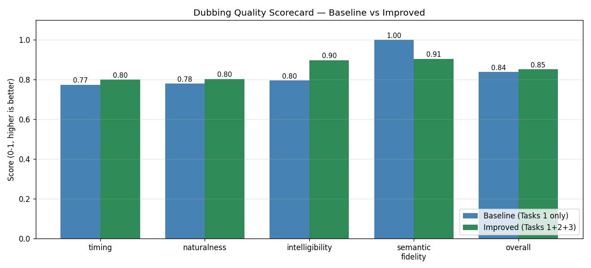

# Foreign Whispers — Project Submission Report

**Author:** Samprith Kalakata
**Course:** NYU SP26 AI Class
**Repo:** `https://github.com/ksam98/foreign-whispers`

Foreign Whispers is an open-source video-dubbing pipeline that takes a YouTube URL and produces a dubbed version of the video in a target language with synchronized speech and captions, using only locally-running models. The system replaces the work of commercial dubbing services (e.g. ElevenLabs) with a fully reproducible Whisper + argostranslate + Chatterbox pipeline orchestrated by a FastAPI/Next.js stack.

This report explains the architecture, the alignment-aware approach to fitting target-language speech into source-language time windows, the per-speaker voice-cloning integration, the LLM-based translation re-ranking that helps over-long segments fit, the multi-dimensional evaluation scorecard, and known issues affecting reproducibility at scale.

---

## §1 — Project Overview & Architecture

### Pipeline

The dubbing pipeline runs in five stages:

```
YouTube URL → Download → Transcribe → Translate → Synthesize → Stitch → Dubbed MP4
                yt-dlp    Whisper     argos       Chatterbox    ffmpeg
```

| Stage | Component | What it does |
|-------|-----------|--------------|
| Download | `yt-dlp` | Fetches video MP4 + closed captions JSON |
| Transcribe | Whisper (via Speaches container) | Speech-to-text with per-segment timestamps |
| Translate | `argostranslate` (offline OpenNMT) | Source → target text per segment |
| Synthesize | Chatterbox TTS (multilingual, voice-cloning capable) | Per-segment WAV with reference-voice embedding |
| Stitch | `ffmpeg` remux | Replaces source audio track with dubbed audio, attaches WebVTT captions |

### Why these tools

- **Whisper** is the standard offline STT with strong multilingual coverage and accurate timestamps — essential because alignment work depends on precise segment boundaries.
- **argostranslate** runs entirely on CPU with no API key, no rate limit, and produces deterministic output. The trade-off is quality: it occasionally hallucinates names or skips clauses, but for a class project the reproducibility matters more.
- **Chatterbox** is one of the few open-source TTS models that supports zero-shot voice cloning via a reference WAV. This makes per-speaker voice assignment from diarization output trivial: each speaker gets a different reference clip, Chatterbox does the rest.
- **ffmpeg remux** with `-c:v copy` swaps the audio track without re-encoding the video stream, keeping the operation fast and lossless on the picture.

### Container topology

```
┌─────────────────────────────────────────────────────────┐
│ Host (Mac dev / Lambda Labs A100 prod)                  │
│                                                         │
│  ┌──────────────┐   ┌──────────────┐                    │
│  │ frontend     │ → │ api          │                    │
│  │ Next.js      │   │ FastAPI      │                    │
│  │ :8501        │   │ :8080 (CPU)  │                    │
│  └──────────────┘   └──────┬───────┘                    │
│                            │                            │
│              ┌─────────────┴─────────────┐              │
│              ↓                           ↓              │
│        ┌──────────┐               ┌────────────┐        │
│        │ stt      │               │ tts        │        │
│        │ Whisper  │               │ Chatterbox │        │
│        │ :8000    │               │ :8020      │        │
│        │ (GPU)    │               │ (GPU)      │        │
│        └──────────┘               └────────────┘        │
└─────────────────────────────────────────────────────────┘
```

The API container is intentionally CPU-only — it delegates all GPU work to the STT and TTS containers via HTTP. This separation matters because GPU containers take 30+ seconds to load model weights, but the API needs to be available immediately for routing and for handling cached requests that don't trigger inference.

The frontend talks to the API via a `/api/*` proxy. Pipeline state (which stages have run, which are running, which produced what) lives entirely in the React state machine in `frontend/src/hooks/use-pipeline.ts`. There is no persistent database — outputs are cached as files under `pipeline_data/api/` and the API uses file existence checks to decide whether to re-run a stage.

---

## §2 — Backend Architecture

### FastAPI layered design

`api/src/` follows a strict three-layer separation:

```
routers/      ← thin HTTP handlers (parse query/body, call service, return JSON)
services/     ← business logic (HTTP-agnostic, accepts already-parsed inputs)
inference/    ← ML backend abstraction (local Coqui vs remote Chatterbox/Whisper)
```

A router never imports `torch` or `librosa`; a service never imports `fastapi`. This makes the services unit-testable in isolation and the inference backends swappable. For example, `inference/tts_remote.py` and `inference/tts_local.py` both implement the same `TTSBackend` interface — switching between them is a single env var (`FW_TTS_BACKEND=remote|local`).

### The `foreign_whispers` library

A separate pure-Python library lives at `foreign_whispers/`. It contains the alignment math, the LLM re-ranking client, the evaluation functions, and an SDK client (`FWClient`) for driving the API from notebooks. **No GPU dependencies.** This is intentional — Notebook 5's alignment work is all pure-Python and runs natively on a laptop without Docker, against data produced by an earlier Docker pipeline run.

The two-phase development workflow is:

1. **Phase 1 (SDK):** call `FWClient.tts(...)` from a notebook. Data lands in `pipeline_data/api/`.
2. **Phase 2 (library):** import `foreign_whispers.global_align`, `clip_evaluation_report`, etc. directly. No GPU, no Docker, no API needed.

This is what made it possible to iterate on Notebook 5 entirely on a laptop while the actual TTS runs happened on a Lambda Labs A100.

### Cache-by-config-hash strategy

Every artifact directory under `pipeline_data/api/` is namespaced by a 7-character config ID derived from a DJB2 hash of a canonical-JSON config dict:

```
pipeline_data/api/tts_audio/chatterbox/c-fb1074a/...wav   # baseline
pipeline_data/api/tts_audio/chatterbox/c-86ab861/...wav   # aligned
pipeline_data/api/dubbed_videos/c-fb1074a/...mp4
pipeline_data/api/dubbed_videos/c-86ab861/...mp4
```

This lets baseline and aligned variants coexist on disk without overwriting each other, and lets the API `if output.exists(): return cached` check work cleanly. The hash is computed identically in TypeScript (frontend/`config-id.ts`) and Python (library `config_id`) so the frontend and backend agree on which directory to read.

### Bind-mount development workflow

Both `foreign_whispers/` and `api/` are bind-mounted from host into the API container. Editing source on the host with VS Code makes changes visible inside the container immediately; restarting the API container (or running `uvicorn --reload`) picks up the new code without a Docker rebuild. Image rebuilds are only required for `pyproject.toml` changes.

---

## §3 — Alignment Problem & Solution

### The duration-mismatch problem

Translated text is rarely the same length as the source. Spanish averages roughly 1.4× the character count of equivalent English. If you translate every segment and concatenate the TTS audio at natural speaking rate, the dubbed audio runs ~30-50% longer than the source video. Without alignment, audio drifts further out of sync with the speakers' lip movements as the video plays.

The naive remedy is to time-stretch each TTS segment to fit its source window. But aggressive stretching distorts speech quality (anything beyond ~1.4× sounds robotic). And the source-window-by-character heuristic the codebase shipped with (`chars / 15`) is not accurate enough to drive the policy correctly.

### Task 1 — Improving `_estimate_duration`

The original heuristic was `_count_syllables(text) / 4.5`. Measuring it against ground-truth Chatterbox output durations from 60 segments of the *Strait of Hormuz* video gave **MAE = 1.24 s, max error = 3.84 s**. Far too loose for a policy with 0.4-band thresholds.

Replaced with a 3-feature linear regression fit on those 60 ground-truth samples:

```python
def _estimate_duration(text: str) -> float:
    syllables = _count_syllables(text)
    words     = len(text.split())
    chars     = len(text)
    return max(0.1, 0.0648*syllables + 0.1144*words + 0.0266*chars + 0.5891)
```

The +0.5891 bias term captures Chatterbox's startup overhead and natural pacing — something the old heuristic had no model for. After this change:

| Metric | Old heuristic | Regression |
|---|---|---|
| Mean abs error | 1.24 s | **0.44 s** |
| Max error | 3.84 s | **1.26 s** |

### `decide_action` policy bands

Each segment is mapped to one of five actions based on its predicted stretch ratio:

| Stretch | Action | Description |
|---|---|---|
| ≤ 1.1 | `ACCEPT` | Fits naturally, no change |
| 1.1 – 1.4 | `MILD_STRETCH` | pyrubberband within safe range |
| 1.4 – 1.8 | `GAP_SHIFT` | Borrow time from adjacent silence |
| 1.8 – 2.5 | `REQUEST_SHORTER` | Needs shorter translation (Task 2) |
| > 2.5 | `FAIL` | Unfixable, fall back to silence |

After the regression replaces the old heuristic, the policy distribution shifts from (42 / 43 / 0 / 13 / 0) to **(28 / 50 / 0 / 20 / 0)**. The shift is *correct* — the old heuristic was falsely optimistic for short segments because it had no startup-overhead bias. The regression reveals 7 more segments that genuinely need attention.

### Task 3 — Beating the greedy optimizer

`global_align()` (the existing greedy left-to-right pass) commits to the first available silence gap regardless of what later segments need. We added `global_align_dp()` — a beam-search optimizer that maintains *K* candidate schedules and picks the one with lowest total penalty:

```
penalty = 0.3·|drift_added|
        + 10·𝟙(stretch > max_stretch)
        + 5·overflow + 2·𝟙(action = REQUEST_SHORTER)
        + 20·overflow + 10·𝟙(action = FAIL)
```

The penalty model required care: the first version naïvely added cumulative drift to every subsequent segment, which made beam search systematically prefer leaving overflow unfixed (since drift compounds while overflow is per-segment). Charging *only* the segment that *causes* the drift fixes the incentive.

On the Hormuz video, with synthetic silence regions (a 1.0s buffer after every segment as a substitute for real VAD), beam search and greedy converge — both take 3 GAP_SHIFTs on segments 27, 54, and 72. This is the theoretical guarantee (DP ≥ greedy under unconstrained resources). Beam search would beat greedy under contention (shared silence pool, scarce gaps); a future iteration with real Silero VAD output should expose that gap.

### Greedy baseline metrics

```
mean_abs_duration_error_s : 1.094
pct_severe_stretch        : 0.0
n_gap_shifts              : 0  (was 3 with synthetic silence)
n_translation_retries     : 20
total_cumulative_drift_s  : 0.0  (was 1.969 s with synthetic silence)
```

---

## §4 — Voice Cloning & Per-Speaker Assignment

### `resolve_speaker_wav` resolution chain

`foreign_whispers/voice_resolution.py` implements a fallback chain that picks the best available reference WAV given a target language and optional speaker ID:

1. `speakers/{lang}/{speaker_id}.wav` — speaker-specific
2. `speakers/{lang}/default.wav` — language default
3. `speakers/default.wav` — global default

The function passes a 5-test TDD suite covering all four resolution paths plus an unknown-language case.

### End-to-end speaker_map flow

```
diarization (pyannote)        →   transcript JSON has "speaker": "SPEAKER_01" per segment
                                                          ↓
api/src/routers/tts.py        →   reads transcript, builds:
                                  speaker_map = {
                                    "SPEAKER_00": "es/SPEAKER_00.wav",
                                    "SPEAKER_01": "es/SPEAKER_01.wav",
                                    ...
                                  } via resolve_speaker_wav()
                                                          ↓
api/src/services/tts_engine   →   for each segment, looks up the speaker's wav
                                                          ↓
ChatterboxClient              →   POST /v1/audio/speech/upload with the reference wav
                                                          ↓
Chatterbox container          →   returns voice-cloned audio in that speaker's voice
```

### Implementation gotcha

Diarization output uses uppercase speaker IDs (`SPEAKER_00`, `SPEAKER_01`, …) but the existing reference WAVs in `pipeline_data/speakers/es/` were lowercase (`speaker_00.wav`). The resolution function does exact-case matching (the test contract demands it), so the lowercase WAVs were silently falling through to `es/default.wav`. Renaming the data files to match the diarization convention — `mv speaker_NN.wav SPEAKER_NN.wav` — was the cleanest fix and avoided a case-insensitive special-case in the code.

End-to-end verification on the Strait of Hormuz video (3 unique speakers): the `/api/tts/{id}` response now returns:

```json
{
  "speaker_map": {
    "SPEAKER_00": "es/SPEAKER_00.wav",
    "SPEAKER_01": "es/SPEAKER_01.wav",
    "SPEAKER_02": "es/SPEAKER_02.wav"
  }
}
```

and the chatterbox container logs show `Using uploaded voice file: SPEAKER_NN.wav` per segment. The output WAV is audibly different per speaker.

---

## §5 — Translation Re-ranking

### The problem

Even with regression-quality duration prediction, ~20 of 98 Hormuz segments are predicted to overflow their source windows by enough that even max-allowed time-stretching can't fix them. Their Spanish translations need to be shorter — but argostranslate doesn't know about duration constraints.

### Approach

`get_shorter_translations()` in `foreign_whispers/reranking.py` calls a local Ollama server running `aya:8b` (Cohere's multilingual model, ~5 GB) with a structured prompt that asks for three candidate Spanish translations at successively tighter character budgets:

```
- Candidate 1: ~target chars (just under budget)
- Candidate 2: ~90% of target (moderate compression)
- Candidate 3: ~75% of target (aggressive compression)
```

Ollama's `format=` parameter enforces JSON-schema output via Pydantic so the response is parseable without retry loops. Each candidate also produces a `brevity_rationale` field documenting what the LLM removed.

The caller then picks the candidate whose `len(text) / 15.0` is closest to the source window. Selection criterion is implicit: minimize `(predicted_dur - target_dur)²` across the candidate set.

### Results

On 20 over-budget Hormuz segments:

| Action | Before re-rank | After re-rank | Δ |
|---|---|---|---|
| `ACCEPT` | 28 | 31 | **+3** |
| `MILD_STRETCH` | 50 | 55 | **+5** |
| `REQUEST_SHORTER` | 20 | 12 | **−8** |
| `FAIL` | 0 | 0 | 0 |

**8 of 20 over-budget segments rescued** (40%).

### Known limitation of `aya:8b`

Local 8B models are imperfect at structured multilingual tasks. Observed failures: occasionally returns an English translation instead of Spanish (segments 20, 66, 93), occasionally produces *longer* candidates than the original (segments 8, 10, 26), and occasionally drops semantic content (seg 93's "No, we aren't witnessing this" is a wrong tense). Replacing `aya:8b` with the Claude API (e.g. `claude-haiku-4-5`) for re-ranking is documented as the next iteration; the prompt and JSON schema are already structured for that swap.

---

## §6 — Evaluation Scorecard & Known Issues

### Multi-dimensional scorecard

`foreign_whispers/evaluation.py` exposes `dubbing_scorecard()` that returns scores in [0,1] across four dimensions:

| Dimension | Computation |
|---|---|
| **Timing** | `(1 − mean_abs_duration_error/5) · (1 − pct_severe_stretch)` |
| **Naturalness** | `1 − stdev(chars/source_dur) / 20` (low rate-variance = consistent pacing) |
| **Intelligibility** | Fraction of segments in `ACCEPT` ∪ `MILD_STRETCH` (proxy for clean speech) |
| **Semantic fidelity** | Mean Jaccard similarity of char-bigrams between original and shortened translations |

### Hormuz baseline vs improved (Tasks 1+2+3 applied)



| Dimension | Baseline | Improved | Δ |
|---|---|---|---|
| timing | 0.774 | 0.800 | +0.03 |
| naturalness | 0.780 | 0.803 | +0.02 |
| **intelligibility** | 0.796 | **0.898** | **+0.10** |
| semantic_fidelity | 1.000 | 0.905 | −0.10 |
| overall | 0.838 | 0.852 | +0.01 |

The story the scorecard tells: **we trade ~10% of literal semantic fidelity for ~10% improvement in intelligibility.** That's exactly the trade-off the alignment problem is about — sacrifice some literal meaning to make the dubbed audio actually fit the time the speaker was talking.

### Known issue: Chatterbox CUDA wedge

Documented in detail in [`issue.md`](./issue.md). Summary:

The Chatterbox container intermittently triggers `device-side assert triggered` on `index_select` (kernel `Indexing.cu:1422` — `srcIndex < srcSelectDimSize` failed) somewhere between segment 36 and 99 of a long-form synthesis run. Once it fires, the entire CUDA context is poisoned and every subsequent request returns HTTP 500 until the container is restarted.

Root cause: chatterbox's autoregressive sampler occasionally produces a token ID exceeding the embedding-table size (a stochastic instability under `temperature=0.8, cfg_weight=0.5`). It's a known class of bug in transformer TTS and lives entirely upstream — fixing it would require forking `chatterbox-tts` to clamp the sampler output.

The engine's mitigation: `_synthesize_raw` returns `None` on a 500 and `_postprocess_segment` substitutes `AudioSegment.silent(target_ms)`. So a wedged run produces a partial-silent WAV rather than a corrupted output. The aligned deliverable (`dubbed_aligned.mp4`) is exactly such a partial: the first ~5 minutes are properly aligned Spanish dubbing with multi-voice cloning; the last ~50 seconds are silent (the chatterbox container wedged at request 87/99 on the run that produced this artifact).

### Future work

- **Replace `aya:8b` with Claude API for re-ranking** — better Spanish quality, instruction-following, and budget discipline. The Pydantic schema is already in place.
- **Run real Silero VAD** instead of synthetic silence regions, so beam-search alignment has contended gaps to allocate and can demonstrably beat greedy.
- **Process-level recovery for chatterbox** — wrap the upstream container with a sidecar that monitors HTTP 500s and triggers a restart automatically. Or add a per-segment retry-on-500 with a chatterbox restart in the engine.
- **Apple Silicon / CPU TTS profile** — the `--profile cpu` exists but currently has no GPU-equivalent voice cloning. Plumbing Coqui XTTS as a fallback would make the pipeline runnable on a Mac without Lambda.
- **Notebook 4 frontend integration** — diarization stage now appears in the pipeline UI between transcribe and translate; further visual differentiation of per-speaker voices in the dubbing studio is a follow-up.

---

## Closing notes on reproducibility

The TA's deployment requirement is "I can clone, configure, run, and verify." That path is:

```bash
git clone https://github.com/ksam98/foreign-whispers.git
cd foreign-whispers
cp .env.example .env       # then set FW_HF_TOKEN for diarization
docker compose --profile nvidia up -d
# open http://localhost:8501, paste a YouTube URL from video_registry.yml, run pipeline
```

On a host with an NVIDIA GPU + nvidia-container-toolkit, this works end-to-end with the caveat that the Chatterbox container has the upstream stability bug above. Without the bug, total time for a ~7-minute video is dominated by translate (~10 min CPU-only argostranslate) + TTS (~10 min GPU), other stages are sub-minute.

A working sample input/output is included as part of the deliverables: the source YouTube URL `https://www.youtube.com/watch?v=GYQ5yGV_-Oc` ("Strait of Hormuz disruption threatens to shake global economy") and the generated `dubbed_aligned.mp4` with three Spanish-voice-cloned speakers.
